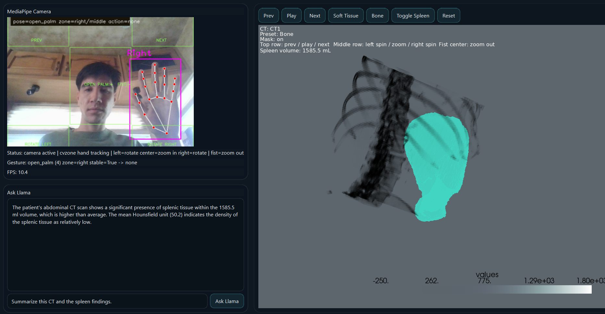
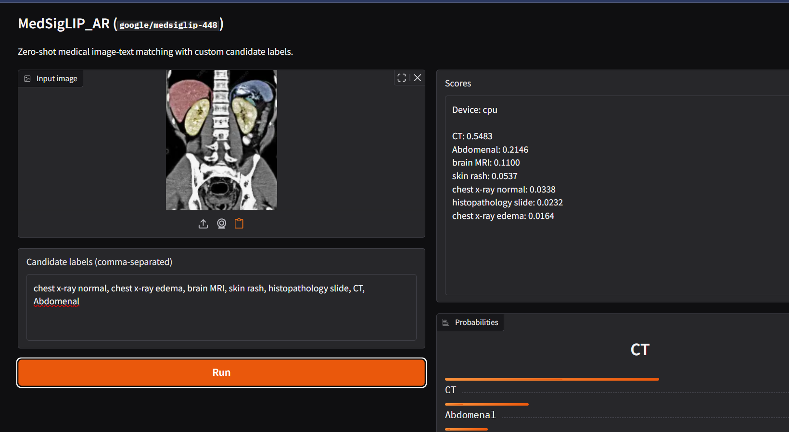

## here is the link for the video: https://vanderbilt.box.com/s/p1slvswmyji1zgjm4c27uofeamyxvgno

# AI-Assisted AR Medical Image Exploration using Multimodal Models

## Latest Prototype Screenshot

The screenshot below shows the latest native prototype: a cleaned 3D medical object view with webcam-based hand interaction and grounded chatbot response.



## Current MVD

The current minimum viable design has moved from the earlier browser-first prototype to a native Python prototype built around `SimpleITK`, `VTK`, and `PyVista`. The current working path is:

- CT preprocessing to remove table/background and crop to the body
- optional spleen mask loading and spleen-only extraction
- rigid registration of longitudinal scans into a fixed reference (`CT4`)
- a native 3D viewer for bone-context rendering with spleen overlay
- a native dashboard with webcam-based hand gesture zones and an Ollama-backed text assistant
- a longitudinal timeline viewer that plays registered scans over time

The current prototype code is stored in:

- `native_vtk_prototype/app`
- `native_vtk_prototype/scripts`

Earlier screenshot from the initial chatbot-style concept:



The main prototype capabilities are:

- cleaned 3D CT rendering with reduced table/background artifacts
- spleen overlay and spleen-only object preparation
- CT-to-CT rigid registration for longitudinal comparison
- playback of registered series (`CT1`, `CT3`, `CT4`)
- simple gesture-driven navigation and zoom control
- grounded LLM responses from spleen mask-derived metrics

The current processing flow is:

```text
Raw CT -> body cleanup -> spleen mask alignment -> rigid registration to CT4 -> 3D viewer / timeline / dashboard
```

Typical local run order for the prototype is:

```powershell
cd C:\Users\adams\Documents\Projects\ARMedVLMProposal\native_vtk_prototype
.\scripts\run_preprocess_all.ps1
.\scripts\run_register_all.ps1
.\scripts\run_timeline.ps1
```

For the interactive native dashboard:

```powershell
cd C:\Users\adams\Documents\Projects\ARMedVLMProposal\native_vtk_prototype
.\scripts\run_native_dashboard.ps1
```

## Project Goal

This project aims to develop an augmented reality system for interactive exploration of volumetric medical images such as CT scans. The system will allow a user to load a medical volume, visualize it in 3D, manipulate it through slicing and viewpoint controls, and query an integrated multimodal model to obtain semantic information from selected slices or regions of interest. The core objective is to combine spatial visualization and AI-based interpretation in a single workflow rather than treating them as separate tools.

This project is interesting because most current AR medical imaging systems emphasize rendering and interaction, while recent multimodal biomedical models focus on offline classification or retrieval. Few systems connect immersive visualization with real-time semantic reasoning. The proposed system explores that gap by combining AR-based medical image viewing with VLM-based interpretation, with the longer-term goal of supporting more intelligent clinical and research interfaces.

## Technical Approach

The system has four main components: data preprocessing, AR visualization, interaction, and AI inference.

### 1. Data Processing

Input data will consist of CT volumes in NIfTI or DICOM format. The preprocessing stage will handle resampling, intensity normalization, and optional segmentation or threshold-based extraction of relevant structures. The processed data will then be converted into either:

- slice textures for 2D or pseudo-volume interaction inside AR
- surface meshes generated from thresholding or marching cubes for 3D rendering

This stage will be implemented in Python using medical imaging libraries such as `SimpleITK`, `nibabel`, `MONAI`, or `VTK` as needed.

### 2. AR Visualization

The visualization environment will be built in `Unity`, using `AR Foundation` as the main cross-platform AR framework. Depending on available hardware, the deployment target will be one of the following:

- iPhone or iPad using `ARKit`
- Android device using `ARCore`
- Meta Quest in VR or passthrough mode if AR deployment becomes impractical

The rendering system will support:

- display of a 3D medical object or stack of slices
- slicing plane interaction
- threshold or opacity adjustments
- camera-relative repositioning and scaling of the medical volume

### 3. Interaction Layer

The user will be able to:

- rotate and scale the volume
- move a slicing plane through the scan
- select or define a region of interest
- request semantic interpretation of the currently selected slice or region

Interaction will initially be implemented using standard Unity UI controls and touch or controller input. If time allows, the system may be extended with voice or text query input.

### 4. AI Inference

The AI component will use a biomedical multimodal model such as `BiomedCLIP` or `MedSigLIP` for image-text alignment. A selected slice or extracted ROI will be passed from the visualization system to a Python inference pipeline, which will compute similarity against candidate medical text prompts or labels. The resulting semantic output will then be returned to the AR application and displayed in the user interface.

The expected inference path is:

`CT volume -> selected slice or ROI -> multimodal model -> similarity scores or predicted concept -> AR overlay or UI text`

### System Architecture

```text
Medical Image Volume
        |
        v
Preprocessing Pipeline
        |
        v
Unity AR Application
|-------------------------------|
| Rendering | Interaction | AI  |
|-------------------------------|
        |
        v
Selected Slice / ROI
        |
        v
BiomedCLIP / MedSigLIP Inference
        |
        v
Semantic Output in AR
```

## Novelty and Contribution

This project is a systems integration effort under meaningful technical constraints rather than a new model contribution. The novelty lies in combining immersive medical image visualization with semantic image understanding in a single interactive AR pipeline. Existing AR systems often stop at rendering and basic manipulation, while multimodal medical models are usually evaluated offline in Python notebooks or batch pipelines. This project combines those two areas into one interface.

The main contribution is an interactive prototype that allows a user not only to view medical image data in AR, but also to ask the system for semantic interpretation of the current visual context. In that sense, the project is a new application of biomedical multimodal models within an AR workflow, with emphasis on practical integration, interaction design, and performance tradeoffs.

## Evaluation Plan

The project will be evaluated with at least one rigorous technical evaluation and several supporting tests.

### 1. End-to-End Functional Evaluation

The first criterion is whether the full pipeline works:

- load a medical volume
- render it correctly in Unity
- allow slice or ROI selection
- send the selected image data to the multimodal model
- display the returned semantic result inside the interface

Success will be defined as reliable end-to-end execution across a small set of test volumes.

### 2. Performance Evaluation

The system must remain usable interactively. The following metrics will be measured:

- rendering frame rate
- latency from user interaction to semantic response
- memory usage for typical volumes

Target values:

- interactive rendering near or above 30 FPS
- AI response latency below 1 to 2 seconds for a selected slice

### 3. Comparative Evaluation

To justify the AI component, the project will compare:

- AR visualization only
- AR visualization with semantic model output

The evaluation question is whether the model output adds meaningful information during exploration. This will be assessed using a small, carefully designed comparison on representative examples, focusing on whether returned predictions or similarity labels are relevant to the selected anatomy or pathology.

### 4. Stress Testing

The system will also be stress-tested on:

- larger volumes
- noisier scans
- different scan orientations or preprocessing conditions

This will help define practical operating limits and identify failure modes.

## Milestones and Contingencies

### Minimum Viable Demo

The minimum viable version of the project will include:

- loading a CT volume into Unity
- basic volume placement and slicing interaction
- export of a selected slice or ROI
- inference with a biomedical image-text model
- display of the returned semantic result in the Unity interface

### Expected Hardest Component

The hardest component is likely to be the integration between Unity and the AI inference pipeline, especially if low-latency interaction is required. A second likely challenge is handling medical image formats and coordinate consistency between preprocessing and the AR scene.

### Contingency Plan

If full AR deployment becomes too difficult within the available time, the fallback will be:

- switch from mobile AR to desktop Unity or VR mode
- use preprocessed PNG slices instead of full volumetric data
- precompute model outputs for a set of slices rather than performing fully live inference

This keeps the project scientifically valid while reducing engineering risk.

## Success Criteria

The project will be considered successful if it satisfies the following:

- the system runs end-to-end on at least one medical volume
- the user can manipulate the medical data interactively
- the multimodal model returns meaningful semantic outputs for selected slices or ROIs
- the interface remains responsive enough for live demonstration

## Repository Scope

This repository is intended to store the project proposal, technical design notes, implementation code, and future evaluation artifacts for the AR medical image exploration system.
